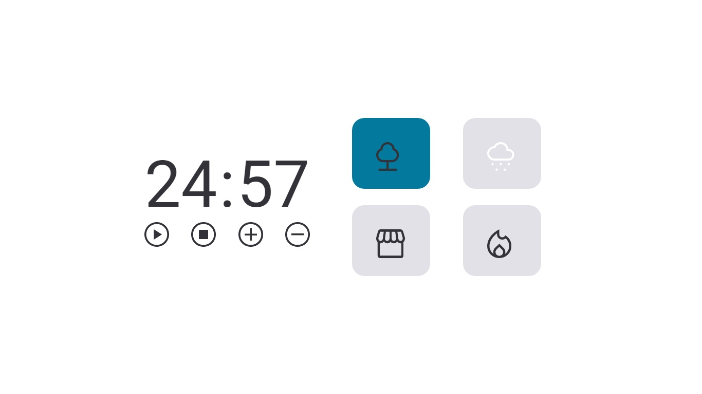

# Desafio FocusTimer - Versão 2.0

Desafio do Stage05 que faz parte do Programa Explorer da Rocketseat  

A ideia agora é criar o FocusTimer 2.0!  
Cada card que se encontra do lado direito, quando selecionado, vai mudar de cor e emitir um som diferente. Os sons você pode encontrar, respectivamente, nos links abaixo:  

[**Floresta**](https://drive.google.com/file/d/1CRHkV72WUMdcqec5GT_KdsqFz0z3VAOA/view)  

[**Chuva**](https://drive.google.com/file/d/1Ip8xBqAUJ-bty51Wz8JBtX_bWXCgA0P2/view)  

[**Cafeteria**](https://drive.google.com/file/d/1OxLKpCwg2wrxXFNUHgZxJ51QEt0ac5RA/view)  

[**Lareira**](https://drive.google.com/file/d/1MakaBPxJvTa_whaSM3kEbRcxiVd1GRCB/view)  

Funcionalidades esperadas dos botões:  

- Play   : aciona o timer;
- Stop   : para o timer;
- +    : aumenta em mais 5 minutos o tempo do timer;
- -    : diminui em 5 minutos o tempo do timer.

## Screenshots

[🔗 Clique aqui para acessar o Projeto](https://fabiovascao.github.io/JavaScript-Desafio1/)  
[🔗 Clique aqui para acessar o Figma](https://www.figma.com/file/TFbSwlcbN63y81PQyHxyv7/Stage-05-Focus-Timer-2.0-Copy?fuid=1151137169943796805)  

## 🛠 Tecnologias

- HTML
- CSS
- Git e Github
- JavaScript

## Autor

- [@FabioVascão](https://www.github.com/fabiovascao)